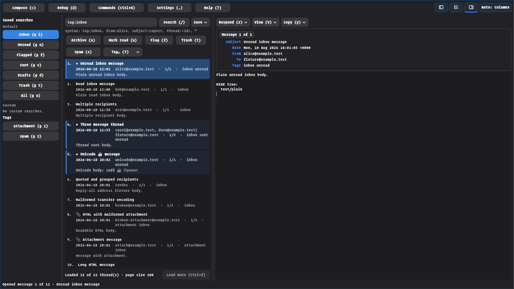

# notm

[](https://github.com/kris004/notm/actions/workflows/ci.yml)

`notm` is a keyboard-first GTK mail client for
[Notmuch](https://notmuchmail.org/). It adds a desktop interface to an existing
Maildir and Notmuch setup without taking over mail delivery or synchronization.

**Project status:** `notm` is pre-1.0, Linux-only, and currently built from
source. It is already usable, but configuration and interface details may
change before the first stable release.



The screenshot uses the repository's synthetic test mailbox. It contains no
real mail or account data.

## Features

- Fast Notmuch queries, saved searches, tag searches, and paged thread results.
- Column and stacked layouts with keyboard navigation throughout the interface.
- Plain-text, sanitized HTML, header, raw-source, and MIME-tree message views.
- Thread- and message-scoped archive, trash, spam, read, flag, and custom-tag
  actions, with undo support.
- Reply, reply-all, forwarding, attachments, address completion, and recoverable
  local drafts.
- Desktop `mailto` handling with editable recipient, Cc, Bcc, subject, and body
  fields, including routing to an already-running notm instance.
- External send and sync commands, so existing tools such as `sendmail`,
  `msmtp`, `mbsync`, or `gmi` can remain part of the mail setup.
- Direct `libnotmuch` access for normal searches, message reads, and tag
  changes.

## How it fits into a mail setup

`notm` is a mail user agent, not a complete mail stack:

```text
fetch/sync tool  ->  Maildir  ->  Notmuch index  <->  notm
                                                     |
                                                     +-> configured send command
```

Mail retrieval and general database updates stay with the tools you choose.
`notm` can run explicitly configured sync commands, but automatic startup sync
is off by default.

## Requirements

The supported build target is Linux. Building requires:

- a current stable Rust toolchain;
- GTK 4.12 or newer;
- GtkSourceView 5.4 or newer;
- WebKitGTK 2.40 or newer with the 6.0 API;
- Notmuch 0.38 or newer, including `libnotmuch` development headers;
- `pkg-config`, Clang/libclang, and a C toolchain.

On Ubuntu 24.04, the native dependencies used by CI can be installed with:

```sh
sudo apt install \
  build-essential clang libclang-dev libgtk-4-dev \
  libgtksourceview-5-dev libnotmuch-dev libwebkitgtk-6.0-dev pkg-config
```

Package names differ on other distributions.

## Build and install

GitHub releases include a prebuilt `x86_64-unknown-linux-gnu` bundle produced on
Ubuntu 24.04, an archive of the exact tagged source, and `SHA256SUMS` covering
both archives. The binary bundle is dynamically linked rather than fully
portable; its `INSTALL.md` lists the required runtime libraries and user-install
command.

Download all three assets before verifying them:

```sh
sha256sum --check SHA256SUMS
gh attestation verify \
  notm-vVERSION-x86_64-unknown-linux-gnu.tar.gz \
  --repo kris004/notm
gh attestation verify \
  notm-vVERSION-src.tar.gz \
  --repo kris004/notm
gh attestation verify SHA256SUMS --repo kris004/notm
```

Future releases use hardware-backed signed annotated tags, attest the exact
workflow artifacts, and are published only after every asset is attached.
Repository release immutability then locks the public tag and assets. Historical
releases retain the verification properties they had when published. See
[the release procedure](docs/releasing.md) for the exact trust and recovery
model.

To build and install the current checkout for your user:

```sh
git clone https://github.com/kris004/notm.git
cd notm
make install-user
```

This installs the binary, desktop entry, icon, AppStream metadata, and man pages
under `~/.local`. Make sure `~/.local/bin` is in `PATH`.

To build without installing:

```sh
cargo build --release -p notm-app
./target/release/notm launch
```

Remove a user installation with `make uninstall-user`. Packagers can override
`PREFIX` and `DESTDIR`; see the [Makefile](Makefile) for the installed paths.

## Quick start

If the standard Notmuch configuration already contains the database path and
user identity, start with:

```sh
notm launch
```

The installed desktop entry advertises notm as a `mailto` handler. To make it
the default for the current desktop user, run:

```sh
xdg-mime default io.github.kris004.notm.desktop x-scheme-handler/mailto
xdg-mime query default x-scheme-handler/mailto
```

Opening an RFC 6068 URI such as
`mailto:alice@example.com?subject=Hello&body=Message` opens an editable
composer; it never sends automatically. notm imports `to`, `cc`, `bcc`,
`subject`, and plain-text `body` values and ignores header fields that its
composer cannot safely represent.

`notm` follows Notmuch's standard configuration, profile, and environment
discovery. Its own optional configuration lives at
`${XDG_CONFIG_HOME:-$HOME/.config}/notm/config.toml`.

A small explicit configuration looks like this:

```toml
[notmuch]
database_path = "/home/alice/Mail"

[identity]
name = "Alice Example"
primary_email = "alice@example.com"

[send]
command = "/usr/sbin/sendmail"
args = ["-t", "-oi"]
mode = "stdin_rfc5322"
```

Use `notm print-config` to inspect the effective configuration. Sensitive
command arguments, environment values, test-harness tokens, and sync commands
are redacted unless `--show-secrets` is explicitly requested.

See [Configuration](docs/configuration.md) for discovery rules and examples,
[Sending mail](docs/send-transport.md) for transport behavior, and
[Synchronization](docs/sync.md) for the optional receive/database-update
commands. The installed `notm-config(5)` manual is the exhaustive reference for
that build.

## Keyboard basics

Press `?` in the application for searchable shortcut help. A few useful keys:

- `/` searches, `:` opens the command palette, and `j`/`k` move through rows.
- `J`/`K` select the next or previous message in a thread; lowercase `j`/`k`
  continue to scroll the message view.
- `Ctrl+e`/`Ctrl+y` scroll the message-list viewport down or up one line without
  changing which message is selected.
- `h`/`l` move between panes; `Ctrl+1`, `Ctrl+2`, and `Ctrl+3` toggle them.
- `g i`, `g u`, `g f`, `g s`, `g d`, `g t`, and `g a` open Inbox, Unread,
  Flagged, Sent, Drafts, Trash, and All Mail.
- `a`, `t`, `s`, `u`, and `f` archive, trash, spam, mark read/unread, and flag.
- `M` opens actions that tag only the currently displayed message. Follow it
  with `a`, `t`, `s`, `u`, or `f` to mirror the corresponding thread action;
  `M T` focuses the custom-tag field. The controls above the thread list remain
  thread-scoped.
- `r r`, `r a`, `r f`, and `r A` reply, reply all, forward inline, and forward
  as an attachment.
- `F` labels every visible link in an HTML message; type a displayed label to
  open that link externally. `Esc` cancels the link-hint mode.
- `c` composes. In the composer, `A` adds an attachment, `S` saves the draft,
  `x` discards it, `D` deletes an opened local draft, and `Ctrl+Enter` sends.

Choosing Text, Visual HTML, Full headers, or Raw source remembers that view for
the current Message-ID. The View menu can also make the currently selected view
the default for that sender with `V a`; a per-message choice takes precedence,
and the same action removes a matching sender default.

## Security and privacy

`notm` has no telemetry or hosted service. Remote images are blocked by default,
HTML is sanitized before display, JavaScript and in-app navigation are disabled,
and the local developer test harness is off unless explicitly enabled. Sending
and synchronization run only through commands configured by the user.

Email is untrusted input, and sanitization is not a substitute for keeping GTK,
WebKitGTK, Notmuch, and `notm` updated. Read the [security policy](SECURITY.md)
before reporting a vulnerability.

## Current limitations

- Linux is the only supported platform. The prebuilt x86_64 bundle targets
  Ubuntu 24.04 or a compatible GNU/Linux system; other systems should build
  from source.
- Account setup, mail retrieval, and SMTP are intentionally delegated to
  Notmuch, Maildir tools, and user-configured helper commands.
- The project has no formal minimum supported Rust version yet; CI tracks the
  current stable toolchain.

## Troubleshooting

- Run `notm print-config` to confirm the effective database, profile, identity,
  and feature gates without exposing secret-bearing values.
- Run `notm probe-send` to validate a configured send helper without submitting
  a message.
- Start with `RUST_LOG=notm=debug notm launch` for diagnostic logging. Remove
  private mail, paths, and command values before sharing logs.
- For reproducible reports, use the synthetic fixture and checks in
  [Testing](docs/testing.md).

## Documentation

- [`notm(1)`](docs/man/notm.1) — commands and normal operation.
- [Configuration](docs/configuration.md) — setup, discovery, and option guide.
- [Sending mail](docs/send-transport.md) — external transport behavior.
- [Synchronization](docs/sync.md) — optional receive and index-update commands.
- [`notm-config(5)`](docs/man/notm-config.5) — exhaustive installed reference.
- [Architecture](docs/architecture.md) — crate layout and runtime model.
- [Testing](docs/testing.md) — fixture, integration, and GTK smoke tests.
- [Developer test harness](docs/automation/README.md) — local UI-driving API.

## Contributing

Bug reports and focused pull requests are welcome. Start with
[CONTRIBUTING.md](CONTRIBUTING.md), especially the notes about fixture testing
and removing private mail data from reports.

## License

`notm` is licensed under [GPL-3.0-or-later](LICENSE), consistent with its use of
`libnotmuch`.
